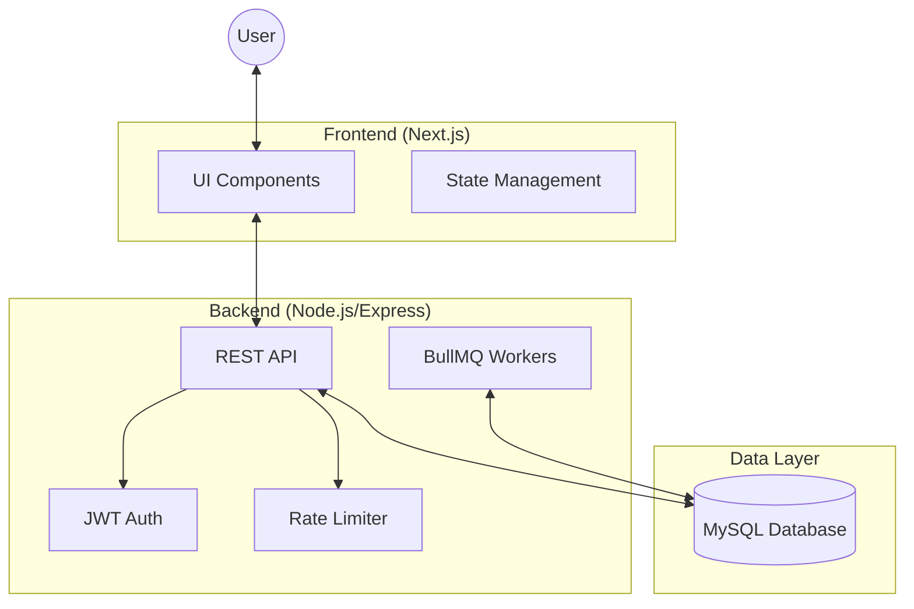

# Task Management System (TMS)

## 📌 Overview
The Task Management System (TMS) is a comprehensive web application designed to track, assign, and manage tasks across different departments and user roles. It features robust user authentication, role-based access control (RBAC), rate limiting, and background job processing to ensure a secure, scalable, and responsive user experience. 

## 🏗️ Architecture
The system follows a modern decoupled architecture:
- **Frontend**: A React-based web interface built with Next.js, featuring responsive design and interactive components.
- **Backend**: A Node.js and Express REST API that handles business logic, database interactions, authentication, and queuing.
- **Database**: PostgreSQL database, managed and queried via Prisma ORM for type-safe data access.
- **Rate Limiting**: Implemented via in-memory rate-limiter-flexible to defend against abuse.

## 📁 Folder Architecture
A clean, modular structure ensures scalability and maintainability:

```text
backend/
 ├── src/
 │   ├── controllers/    # Request handling & business logic
 │   ├── routes/         # API endpoint definitions
 │   ├── middlewares/    # Auth, RBAC, Rate limiting
 │   ├── services/       # Database & external service abstraction
 │   ├── queues/         # BullMQ queue definitions
 │   ├── workers/        # Background job processors
 │   ├── utils/          # Shared helpers & constants
 │   ├── app.ts          # Express application setup
 │   └── index.ts        # Server entry point
 ├── prisma/             # Database schema & migrations
 └── tests/              # k6 performance & unit tests
```

## 📊 Architecture Diagram


## 🔄 System Request Flow
1.  **Request Initiation**: Client sends an HTTP request (e.g., `GET /api/tasks`) with a JWT in the `Authorization` header.
2.  **Rate Limiting**: `rate-limiter-flexible` (Redis-backed) checks if the request exceeds thresholds.
3.  **Authentication**: `authenticateJWT` middleware verifies the token signature and expiration.
4.  **RBAC Authorization**: `allowRoles` middleware ensures the user has sufficient permissions for the requested resource.
5.  **Service Logic**: The controller handles the business logic, interacting with the Database via Prisma.
6.  **Queueing (Optional)**: If the task is long-running (e.g., report generation), it's processed asynchronously in the background.
7.  **Response**: The server returns a JSON response to the client.

## 🗄️ Database Schema
The system uses a relational schema managed by Prisma. Below are the core models:

```prisma
model User {
  id           String      @id @default(cuid())
  email        String      @unique
  password     String?     // Hashed via bcrypt
  role         Role        @default(EMPLOYEE)
  departmentId String?
  approved     Boolean     @default(false)
  createdAt    DateTime    @default(now())
}

model Task {
  id           String     @id @default(cuid())
  title        String
  description  String
  deadline     DateTime
  status       TaskStatus @default(PENDING)
  priorityId   Int?
  assignedById String
  assignees    User[]     @relation("TaskAssignees")
}
```

*Key Relationships: A `Department` has many `Users`, and a `Task` can have multiple `User` assignees.*

## 🛠️ Tech Stack

### Frontend
- **Framework**: Next.js 15, React 19
- **Styling**: Tailwind CSS 4, Radix UI Primitives, Framer Motion
- **HTTP Client**: Axios

### Backend
- **Runtime**: Node.js, Express.js 5
- **ORM**: Prisma 6 (PostgreSQL)
- **Authentication**: JSON Web Tokens (JWT), bcryptjs
- **Rate Limiting**: rate-limiter-flexible (In-memory)
- **Background Jobs**: In-memory async worker

## 🔌 API Endpoints
The backend exposes modular RESTful APIs organized by feature:

* **Users (`/api/users`)**: 
  * `POST /signup`, `POST /login`
  * `GET /`, `GET /me`, `GET /profile`, `GET /pending`
  * `PATCH /approve/:userId`, `PATCH /update/:userId`, `DELETE /delete/:userId`
* **Tasks (`/api/tasks`)**: 
  * `GET /`, `POST /assign`
  * `GET /my-tasks`, `GET /recent`, `GET /delayed`, `GET /previous`, `GET /dashboard-aggregate`
  * `PATCH /:taskId/status`, `PATCH /:taskId/assignees`
* **Departments (`/api/departments`)**
* **Roles (`/api/roles`)**
* **Priorities (`/api/priorities`)**
* **Logs (`/api/logs`)**

## 🔐 Authentication Flow
1. **Signup/Login**: Users authenticate against `/api/users/login` or register via `/api/users/signup`. Password hashing is handled by `bcrypt`.
2. **Token Generation**: Upon successful authentication, the server issues a JSON Web Token (JWT).
3. **Protected Routes**: The frontend attaches the JWT as a Bearer token in the `Authorization` header. The backend `authenticateJWT` middleware validates the token before granting access.

## 🛡️ RBAC Design (Role-Based Access Control)
The application enforces strict access controls based on user roles (`ADMIN`, `MANAGER`, `USER`).
- **Middleware Integration**: The `allowRoles("ADMIN", "MANAGER")` middleware protects sensitive administrative endpoints (e.g., assigning tasks, approving users).
- **Data Scoping**: Managers have scoped access. For example, when fetching users, a `MANAGER` will only receive users belonging to their specific department, while an `ADMIN` has system-wide visibility.

## 🚦 Rate Limiting
To defend against brute-force attacks and ensure fair usage, the system implements Redis-backed rate limiting via `rate-limiter-flexible`:

| Limiter Type | Threshold | Window | Identifier | Target Routes |
|---|---|---|---|---|
| **Auth Limiter** | 10 requests | 15 minutes | IP Address | `/api/users/login`, `/api/users/signup` |
| **Global Unauth Limiter** | 1,000 requests | 15 minutes | IP Address | All unauthenticated requests |
| **Global Auth Limiter** | 1,500 requests | 15 minutes | User ID | All authenticated requests |

## ⚙️ Background Jobs
Heavy, asynchronous tasks are delegated to a simple in-memory worker using `setTimeout` to prevent blocking the main thread.

- **Job Types**: Currently implements simulated tasks like `send-email` and `generate-report`.

## 📈 Load Testing Results

Tests conducted using k6 on 2026-05-27.

| Test Type | Metric | Performance | Status |
|------------|------------|------------|------------|
| **Load Test** | p(95) Duration | 1.54s | ✅ PASS |
| **Soak Test** | Stability | 100% Success (19,591 requests) | ✅ PASS |
| **Stress Test** | Throughput | ~37.6 req/s (7,942 requests) | ✅ PASS |
| **Spike Test** | Recovery Under Sudden Load | 0% Request Failures (3,028 requests) | ✅ PASS |

### Context & Interpretation

These tests were executed against the latest application build using k6.

- **Load Test** verified normal production traffic patterns with zero request failures.
- **Stress Test** sustained up to 150 virtual users while maintaining stable response times.
- **Spike Test** simulated sudden traffic surges up to 200 virtual users and recovered successfully without request failures.
- **Soak Test** validated long-duration stability over 19,591 requests with no observed failures.

### Historical Results

For complete benchmark history, raw k6 outputs, and previous performance runs, refer to:

`backend/tests/k6/performance_results.log`

## 🚀 Setup Instructions

### Prerequisites
- Node.js (v20+)
- PostgreSQL Database
- Redis Server (Running locally or as a service)

### 1. Database & Config Setup
1. Clone the repository and navigate to the project root.
2. In the `/backend` directory, create a `.env` file based on `.env.example` defining your `DATABASE_URL` (PostgreSQL) and `JWT_SECRET`.
3. In the `/frontend` directory, configure your `.env` variables (e.g., `NEXT_PUBLIC_API_URL`).

### 2. Backend Initialization & Database Seeding
```bash
cd backend
npm install
npx prisma generate
npx prisma db push     # Sets up postgres schema
node scripts/clean_and_seed.js   # Wipes database and injects approved seed accounts!
npm run dev            # Starts the Express server on port 5000
```

### 3. Frontend Initialization
```bash
cd frontend
npm install
npm run dev            # Starts the Next.js server on port 3000
```

### 🔑 Active Database User Credentials
The database has been seeded with three default approved accounts:

1. **System Admin**
   * **Email**: `admin@tasksync.com`
   * **Password**: `adminpassword123`
   * **Role**: `ADMIN`
2. **Operations Manager**
   * **Email**: `manager@tasksync.com`
   * **Password**: `managerpassword123`
   * **Role**: `MANAGER`
3. **Productive Employee**
   * **Email**: `employee@tasksync.com`
   * **Password**: `employeepassword123`
   * **Role**: `EMPLOYEE`

## 🌍 Production Environment
For optimal performance and reliability, the following production stack is recommended:

- **Frontend**: Next.js (Deployed on Vercel or AWS Amplify)
- **Backend**: Node.js managed by **PM2** for process management and auto-restart.
- **Reverse Proxy**: **Nginx** for SSL termination, load balancing, and static asset caching.
- **Database**: Managed **PostgreSQL** instance.
- **Queue System**: Managed **Redis** instance for BullMQ and Rate Limiting.
