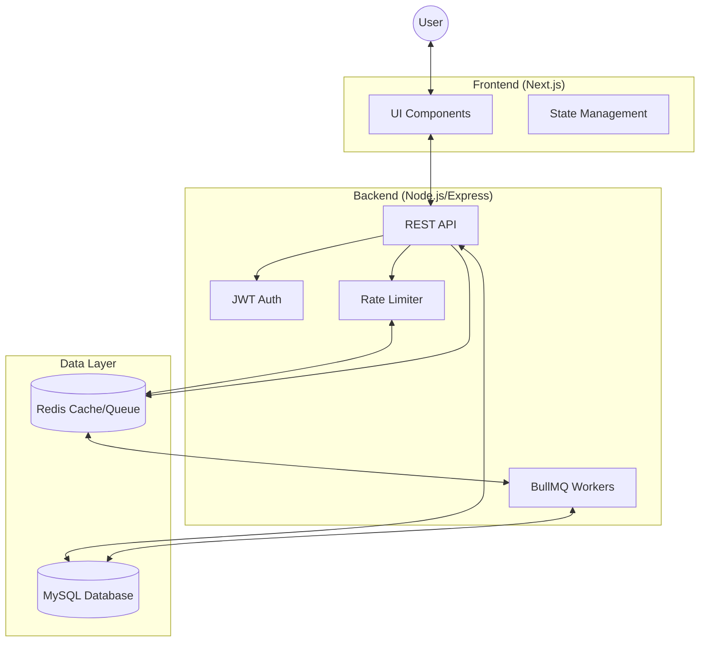

# Task Management System (TMS)

## 📌 Overview
The Task Management System (TMS) is a comprehensive web application designed to track, assign, and manage tasks across different departments and user roles. It features robust user authentication, role-based access control (RBAC), rate limiting, and background job processing to ensure a secure, scalable, and responsive user experience. 

## 🏗️ Architecture
The system follows a modern decoupled architecture:
- **Frontend**: A React-based web interface built with Next.js, featuring responsive design and interactive components.
- **Backend**: A Node.js and Express REST API that handles business logic, database interactions, authentication, and queuing.
- **Database**: MySQL database, managed and queried via Prisma ORM for type-safe data access.
- **Caching & Queues**: Redis is utilized for both rate limiting and managing background job queues via BullMQ.

## 📊 Architecture Diagram


## 🔄 System Request Flow
1.  **Request Initiation**: Client sends an HTTP request (e.g., `GET /api/tasks`) with a JWT in the `Authorization` header.
2.  **Rate Limiting**: `rate-limiter-flexible` (Redis-backed) checks if the request exceeds thresholds.
3.  **Authentication**: `authenticateJWT` middleware verifies the token signature and expiration.
4.  **RBAC Authorization**: `allowRoles` middleware ensures the user has sufficient permissions for the requested resource.
5.  **Service Logic**: The controller handles the business logic, interacting with the Database via Prisma.
6.  **Queueing (Optional)**: If the task is long-running (e.g., report generation), it's added to a BullMQ Redis queue for background processing.
7.  **Response**: The server returns a JSON response to the client.

## 🗄️ Database Schema
The system uses a relational schema managed by Prisma:

- **User**: Stores identity, credentials, role (`ADMIN`, `MANAGER`, `EMPLOYEE`), and department affiliation.
- **Task**: Main entity for tracking work. Includes title, description, deadline, priority, and status.
- **TaskLog**: Audit trail for task updates.
- **Priority**: Configurable priority levels (e.g., Critical, High, Medium, Low) with colors and ordering.
- **Department**: Organizational units for scoping user and task access.

Relationships:
- **One-to-Many**: `Department` has many `Users`. `User` (as creator) has many `Tasks`.
- **Many-to-Many**: `Task` can have multiple assignees (`Users`).

## 🛠️ Tech Stack

### Frontend
- **Framework**: Next.js 15, React 19
- **Styling**: Tailwind CSS 4, Radix UI Primitives, Framer Motion
- **HTTP Client**: Axios

### Backend
- **Runtime**: Node.js, Express.js 5
- **ORM**: Prisma 6 (MySQL)
- **Authentication**: JSON Web Tokens (JWT), bcryptjs
- **Rate Limiting**: rate-limiter-flexible (Redis-backed)
- **Background Jobs**: BullMQ (Redis-backed)
- **Caching**: ioredis

## 🔌 API Endpoints
The backend exposes modular RESTful APIs organized by feature:

* **Users (`/api/users`)**: 
  * `POST /signup`, `POST /login`
  * `GET /`, `GET /me`, `GET /profile`, `GET /pending`
  * `PATCH /approve/:userId`, `PATCH /update/:userId`, `DELETE /delete/:userId`
* **Tasks (`/api/tasks`)**: 
  * `GET /`, `POST /assign`
  * `GET /my-tasks`, `GET /recent`, `GET /delayed`, `GET /previous`, `GET /dashboard-aggregate`
  * `PATCH /:taskId/status`, `PATCH /:taskId/assignees`
* **Departments (`/api/departments`)**
* **Roles (`/api/roles`)**
* **Priorities (`/api/priorities`)**
* **Logs (`/api/logs`)**

## 🔐 Authentication Flow
1. **Signup/Login**: Users authenticate against `/api/users/login` or register via `/api/users/signup`. Password hashing is handled by `bcrypt`.
2. **Token Generation**: Upon successful authentication, the server issues a JSON Web Token (JWT).
3. **Protected Routes**: The frontend attaches the JWT as a Bearer token in the `Authorization` header. The backend `authenticateJWT` middleware validates the token before granting access.

## 🛡️ RBAC Design (Role-Based Access Control)
The application enforces strict access controls based on user roles (`ADMIN`, `MANAGER`, `USER`).
- **Middleware Integration**: The `allowRoles("ADMIN", "MANAGER")` middleware protects sensitive administrative endpoints (e.g., assigning tasks, approving users).
- **Data Scoping**: Managers have scoped access. For example, when fetching users, a `MANAGER` will only receive users belonging to their specific department, while an `ADMIN` has system-wide visibility.

## 🚦 Rate Limiting
To defend against brute-force attacks and ensure fair usage, the system implements Redis-backed rate limiting via `rate-limiter-flexible`:

| Limiter Type | Threshold | Window | Identifier | Target Routes |
|---|---|---|---|---|
| **Auth Limiter** | 10 requests | 15 minutes | IP Address | `/api/users/login`, `/api/users/signup` |
| **Global Unauth Limiter** | 1,000 requests | 15 minutes | IP Address | All unauthenticated requests |
| **Global Auth Limiter** | 1,500 requests | 15 minutes | User ID | All authenticated requests |

## ⚙️ Background Jobs (BullMQ)
Heavy, asynchronous tasks are delegated to background workers using **BullMQ** and **Redis**.

- **Queue Setup**: Active queue named `background-jobs`.
- **Worker Concurrency**: Processes up to 5 jobs simultaneously.
- **Job Types**: Currently implements simulated tasks like `send-email` and `generate-report`.
- **Resilience**: Features exponential backoff on retries (3 attempts with 2s, 4s, 8s delays) and automatic clean-up of successful jobs while retaining failed ones for debugging.

## 📈 Load Testing Results
Tests conducted using `k6` on 2026-02-27.

| Test Type | Metric | Performance | Status |
|---|---|---|---|
| **Load Test** | p(95) Duration | 456ms | ✅ PASS |
| **Soak Test** | Stability | 100% Succeeded (9978 reqs) | ✅ PASS |
| **Stress Test** | Max Throughput | ~31 reqs/s (6535 reqs) | ✅ PASS |
| **Spike Test** | Recovery | Handled 500 VUs with recovery | ✅ PASS |

*Note: Spike tests showed some failures at 500 VUs, indicating scaling limits for single-node deployment.*

## 🚀 Setup Instructions

### Prerequisites
- Node.js (v20+)
- MySQL
- Redis Server (Running locally or via Docker)

### 1. Database & Config Setup
1. Clone the repository and navigate to the project root.
2. In the `/backend` directory, create a `.env` file based on `.env.example` defining your `DATABASE_URL` (MySQL), `REDIS_URL`, and `JWT_SECRET`.
3. In the `/frontend` directory, configure your `.env` variables (e.g., `NEXT_PUBLIC_API_URL`).

### 2. Backend Initialization
```bash
cd backend
npm install
npx prisma generate
npx prisma db push     # Or 'npx prisma migrate dev' if using migrations
npm run dev            # Starts the Express server on port 5000
```

### 3. Frontend Initialization
```bash
cd frontend
npm install
npm run dev            # Starts the Next.js server on port 3000
```

### 4. Production Deployment
The application is containerized for consistent deployment:

1.  **Build Image**: `docker build -t tms-backend ./backend`
2.  **Environment**: Ensure `.env` files are populated with production credentials.
3.  **Compose**: Use the provided `compose.yaml` for orchestrated startup:
    ```bash
    docker compose up -d
    ```
4.  **Scaling**: The backend can be scaled horizontally; however, sticky sessions or token-based auth (current) is required. Redis and MySQL should be managed as highly available services in production (e.g., AWS RDS, ElastiCache).
